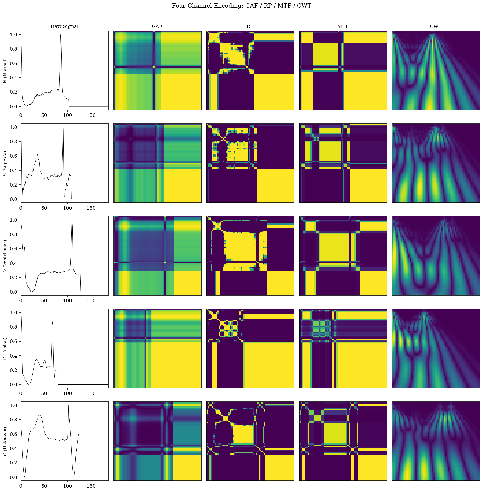
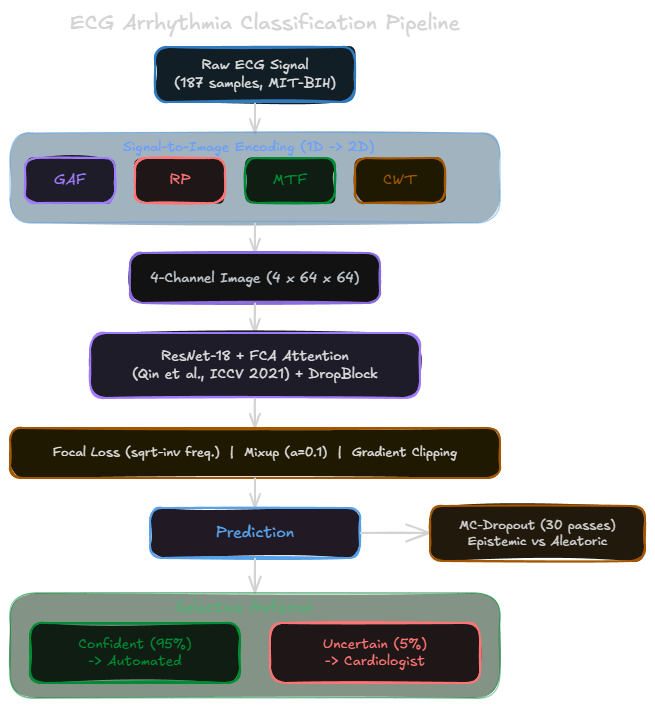
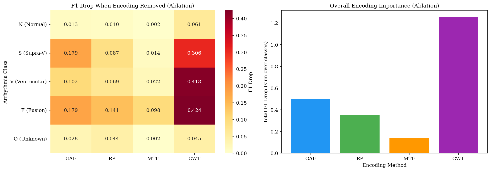
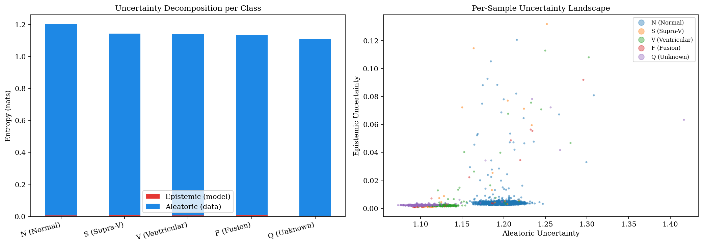
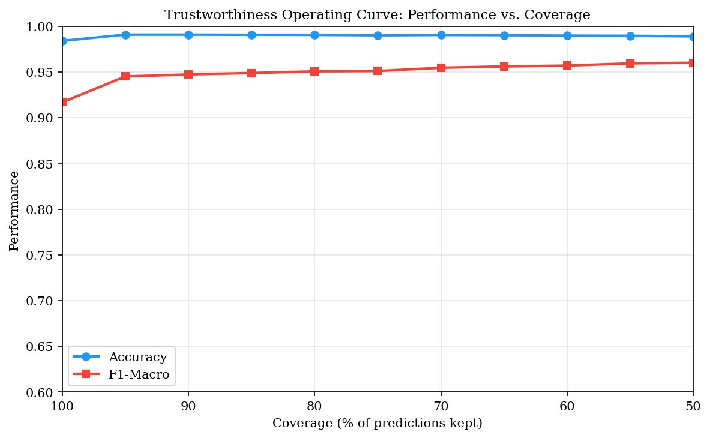

# T-MECA: Trustworthy Multi-Encoding Classification of Arrhythmias

> **AgorAI Spring School Hackathon 2026**  
> Ahlam TARIK — EIDIA, Euromed University of Fes (UEMF)

## Overview

Cardiac arrhythmias affect over 300 million people worldwide. While deep learning achieves high ECG classification accuracy, existing methods lack uncertainty estimation, encoding interpretability, and clinical referral mechanisms.

**T-MECA** addresses this gap by combining four signal-to-image encodings with uncertainty-aware selective referral into a single trustworthy classification pipeline.



## Architecture



## Key Results

| Metric | Value |
|---|---|
| **Accuracy** | **98.41%** |
| **F1-Macro** | **0.916** |
| **F-class Precision** | **81.48%** |
| **Confident Accuracy (95%)** | **99.09%** |

### Per-Class Performance (5-class AAMI)

| Class | Precision | Recall | F1 |
|---|---|---|---|
| N (Normal) | 99.03% | 99.31% | 99.17% |
| S (Supraventricular) | 84.89% | 79.86% | 82.30% |
| V (Ventricular) | 96.32% | 95.86% | 96.09% |
| F (Fusion) | 81.48% | 81.48% | 81.48% |
| Q (Unknown) | 99.50% | 98.76% | 99.13% |

## Contributions

### 1. Channel Ablation Analysis

Systematic per-class ablation reveals that **CWT is the most critical encoding**, with F1 drops up to **0.42** for pathological classes when removed.



### 2. Uncertainty Decomposition

MC-Dropout with 30 forward passes separates epistemic (model) from aleatoric (data) uncertainty. Over **99% of uncertainty is aleatoric**, confirming the model has reached its learning capacity.



### 3. Selective Referral System

An uncertainty-based trustworthiness operating curve shows that referring only **5% of uncertain cases** to a cardiologist raises accuracy from 98.41% to **99.09%**.



## How to Run

1. Upload `T_MECA_notebook.ipynb` to [Kaggle](https://www.kaggle.com/)
2. Enable **GPU (T4)**
3. Add dataset: [`shayanfazeli/heartbeat`](https://www.kaggle.com/datasets/shayanfazeli/heartbeat)
4. Run all cells (~2.5 hours)

## Project Structure

```
T-MECA/
├── README.md                          This file
├── T_MECA_notebook.ipynb              Executed notebook with all outputs
├── poster/
│   └── T-MECA_poster.pdf             AgorAI Hackathon poster
└── results/
    ├── pipeline.png                   T-MECA architecture diagram
    ├── channel_ablation.png           Encoding importance heatmap
    ├── confusion_matrix.png           5-class confusion matrix
    ├── encoding_preview.png           Raw signal → 4 encodings
    ├── trustworthiness_curve.png      Coverage vs accuracy curve
    ├── uncertainty_decomposition.png  Epistemic vs aleatoric
    ├── training_curves.png            Loss and accuracy curves
    └── results_summary.csv            Numerical results
```

## References

1. Moody, G. B. & Mark, R. G. *The impact of the MIT-BIH Arrhythmia Database.* IEEE EMB Magazine, 2001.
2. Qin, Z. et al. *FcaNet: Frequency Channel Attention Networks.* ICCV, 2021.
3. Gal, Y. & Ghahramani, Z. *Dropout as a Bayesian Approximation.* ICML, 2016.
4. Wang, Z. & Oates, T. *Imaging Time-Series to Improve Classification and Imputation.* IJCAI, 2015.
5. Lin, T. Y. et al. *Focal Loss for Dense Object Detection.* ICCV, 2017.
6. Zhang, H. et al. *Mixup: Beyond Empirical Risk Minimization.* ICLR, 2018.

## License

This project is for academic and research purposes under the AgorAI Spring School 2026.
